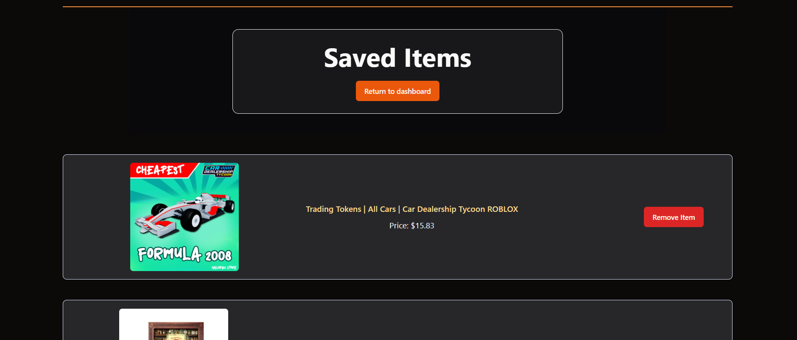

# About Project

eBay SmartSort is a web app that utilizes the eBay API to make search queries and to store and display user preferences in their account. The frontend is built with React and incorporates components from the ShadCN open-source library, while the backend is powered by Flask. User information and preferences are stored and managed using MongoDB.




## Features
- User-friendly interface for logging in and managing preferences.
- Real-time product search using the eBay API.
- Saved items tailored to user-defined preferences.
- Secure user authentication and preference storage.


### Dependencies

Ensure the following are installed on your system:
- [Node.js](https://nodejs.org/en) and npm
- Python 3.x

### Frontend setup
- Navigate to frontend directory
```console
cd frontend
```
- Install dependencies using npm
```console
npm install
```
- Start the development server
```console
npm run dev
```

### Backend Setup
- Navigate to backend dir
```console
cd backend
```
- Create and activate virtual env
```console
python -m venv venv
venv/Scripts/activate
```
- Install requirements
```console
pip install -r requirements.txt
```
- Configure backend `.env` file using your own [eBay developer](https://developer.ebay.com/) credentials and MongoDB database URI. Make sure to Base64 encode your client ID and secret for the eBay developer credentials. 

- Start the flask server
```console
flask run
```

##### NOTE: The default address for the backend server is 127.0.0.1/5000. If you plan to run your backend on a different server, you can configure the IP and port for your backend server in the .env file within the frontend folder.
